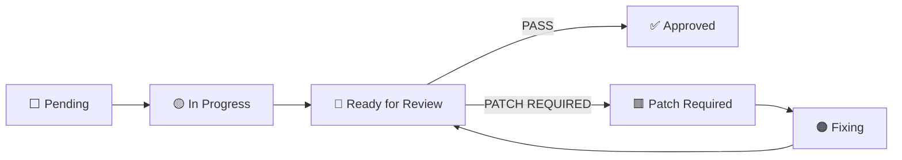

# Frontend Execution Tracker — `project-management/`

**Status:** Active · **Role:** execution layer over the frozen page plan · **Date:** 2026-07-01
**Non-authoritative companion.** Conforms upward; coins nothing. On any conflict the frozen corpus
wins (CLAUDE.md §7, §11) and this folder is patched to match.

This folder is the **live execution queue** for the 3 parallel presentation-only frontend teams. It
adds only a *status layer* on top of the existing plan — it does **not** re-list pages, coin routes,
or invent contracts.

## Precedence & pointers (reference-never-restate)

```
Master → ADR → Doc-2/3 → Doc-4A…4M → Doc-5A…5K → Doc-7A → {7B,7C,7D…7H} → Code
                                                              ▲ this folder tracks, never overrides
```

- **Page IDs + per-page metadata:** [`page_inventory.md`](../page_inventory.md) — the single source
  for the 144-page list and §13 priority. Team files **reference** these `P-*` IDs; they never
  re-list pages.
- **Gap handles:** [`esc_registry.md`](../esc_registry.md) — every `Dependency ≠ Ready` cites a
  handle defined here; never invent a contract.
- **Page standards / vocab:** [`shared_conventions.md`](../shared_conventions.md) (`SC`) +
  [`page-standards.md`](page-standards.md).
- **Reviewer charter:** `governanceReviews/TEAM-4-QCT-CHARTER_v1.0.md` (Team-4 QCT).

## Team ownership (binding)

| Team | Owns | Surfaces (IDs) |
|---|---|---|
| **Team-1** | Public + Shared/Identity | `P-PUB-*`, `P-SH-*`, `P-AUTH-*`, `P-ACC-*` |
| **Team-2** | Buyer | `P-BUY-*` |
| **Team-3** | Vendor + Verification + Admin | `P-VND-*`, `P-ADM-*` (+ verification `P-VND-28`, `P-PUB-18`, `P-ADM-12/13`) |
| **Team-4** | Quality & Conformance (QCT) — **review only** | none (reviews all `🔵 Ready for Review`) |

**Ownership rules:**

1. Each page has **exactly one owning team**.
2. **Only the owning team** may move its page to `🟡 In Progress`.
3. **At most ONE `🟡 In Progress` page per team** at a time.
4. **Team-4 may never modify implementation** — it only reviews and records findings
   (Raise ≠ Accept: the reviewer raises; the author/authority rules — CLAUDE.md §13).

## The loop



### Prompt A — Build (owning team)

```
Read project-management/current-focus.md FIRST.
Take your team's Next Page (or the highest-priority ⬜ Pending row whose Dependency = Ready).
Skip any row whose Dependency ≠ Ready — record the blocking ESC handle, do not build it.
Set the page 🟡 In Progress in your team file + update current-focus.md.
Build ONLY that one page:
  - reuse existing kit/components (src/frontend/, surface _components/); never duplicate primitives
  - honor page-standards.md guardrails (presentation-only, wired-contracts-only, byte-equivalence,
    trust band-only, no invented perf budgets, neutral routing)
  - realistic industrial-procurement mock data; mobile-responsive; WCAG-AA
Set 🔵 Ready for Review. Append the transition to changelog.md.
Print a concise implementation summary. STOP. Never auto-advance to the next page.
```

### Prompt B — Review (Team-4 QCT)

```
Review ONLY the page marked 🔵 Ready for Review, against page-standards.md.
Check: UI consistency · responsive · component reuse · accessibility · visual hierarchy · spacing ·
typography · form validation · empty/loading/error/not-found states · mock-data quality ·
guardrail conformance (no non-disclosure/byte-equivalence leak; trust band-only).
Do not introduce features. Return exactly:
  PASS
  — or —
  PATCH REQUIRED
    <numbered findings on the severity ladder BLOCKER/MAJOR/MINOR/NIT/OBS>
Record the result under a new RV-#### in review-log.md.
On PATCH REQUIRED, set the page 🟥 Patch Required.
```

### Prompt C — After approval / advance

```
If PASS: set the page ✅ Approved in the team file + changelog.md.
If PATCH REQUIRED: 🟥 Patch Required → 🟠 Fixing (apply fixes) → 🔵 Ready for Review (re-review).
Advance current-focus.md to the team's next ⬜ Pending row (Dependency = Ready).
Build only that page (Prompt A). STOP after it is Ready for Review.
```

## Files in this folder

`current-focus.md` (pointer, read first) · `frontend-wbs.md` (board + metrics) ·
`team-1.md` / `team-2.md` / `team-3.md` (queues) · `review-log.md` (findings, `RV-####`) ·
`changelog.md` (append-only) · `page-standards.md` (Definition of Done).

## Governance note

`frontend_first_slice.md` records FE as "planned, not buildable until Wave 3." The owner has
authorized **presentation-only** parallel FE work ahead of that sequence. This tracker operates
**inside that authorization**, tracks the authorized parallel stream, and does **not** reorder the
roadmap. Backend wiring stays gated to each module's wave.
